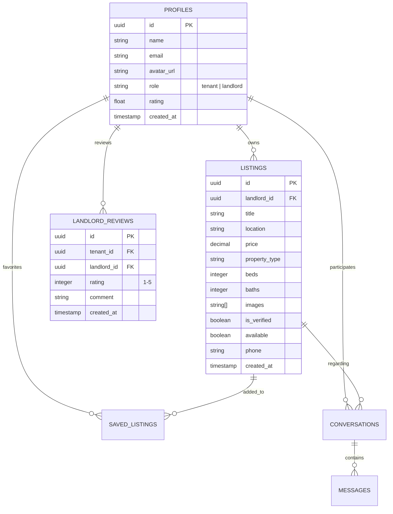

# Nest Real Estate App 🏠✨

**Nest** is an ultra-premium, mobile-first real estate marketplace application designed for the Nairobi metropolitan area. Built with Expo SDK 54, React Native, TypeScript, and powered by a highly secure Supabase backend, Nest bridges the gap between home seekers (tenants) and property managers (landlords) with a gorgeous, high-intensity orange aesthetic and friction-free user workflows.

---

## 🌟 Tech Stack & Infrastructure

Nest utilizes a modern, resilient tech stack engineered for speed, offline safety, and rich visual presentation:
* **Core Framework:** React Native / Expo SDK 54 (Managed Workflow)
* **Router:** File-based navigation via `expo-router`
* **Backend Database:** Supabase (PostgreSQL with custom relational triggers)
* **Storage:** Supabase Storage (for property imagery uploads)
* **Security Layer:** PostgreSQL Row-Level Security (RLS) on all tables
* **Typography:** Premium Google Fonts integration (`Inter`)
* **Vector Icons:** High-fidelity standard vector glyphs (`Ionicons` via `@expo/vector-icons`)
* **Map & Geocoding Engine:** `react-native-maps` with local Euclidean distance matrices for instant suburb mapping

---

## 🔑 Core Features & Workflows

Nest divides its user experience into two highly customized roles: **Tenants** and **Landlords**.

### 1. 🛋️ The Tenant Experience
* **Animated Dashboard Feed:** A beautifully scrolling feed of available listings featuring micro-animations, lazy-loading cards, verified badges, and quick-filter pills (Apartment, House, Studio, Villa, Bedsitter).
* **Robust Suburb Search:** Integrated geolocation-ready suburb selectors letting tenants query real estate by precise locations (such as *Westlands*, *Kilimani*, *Karen*, *Lavington*, *Kileleshwa*).
* **Saved Listings (Favorites):** Secure database bookmarking, allowing home seekers to easily save properties to their profile.
* **Instant WhatsApp Connect:** Redesigned communication buttons that launch WhatsApp directly. To prevent errors, it automatically formats and prepends the regional international country code (e.g. `+254` for Kenya) and constructs a custom prefilled introductory message about the property.
* **Landlord Review System:** Encourages community trust by letting authenticated tenants write reviews and submit 1–5 star ratings for landlords.

### 2. 🔑 The Landlord Experience
* **High-End Statistics Dashboard:**
  * Displays metrics (Total Listings, Active, Taken, and Total Views) inside circular **Doughnut Pie Charts**.
  * Built using high-performance Animated SVGs that dynamically fill with progress tracks when opened.
  * Hosted inside a spacious **horizontal scroll view** that spans end-to-end across the device screen.
* **Premium Post-a-Listing Form:**
  * **Sleek Floating Form Cards:** Replaces flat views with elevated crisp white cards showing warm orange shadows and outline borders.
  * **Uber/Bolt-Style Map Selector:** Features a fixed center-map target pin with custom elevation shadows. Landlords drag the map (or tap on it) to choose properties, and Nest instantly geocodes the coordinates to the nearest named Nairobi suburb!
  * **Integrated Steps Tracker:** Incorporates a beautiful, numbered steps bar (`1`, `2`, `3`) that scrolls naturally with the form fields.
  * **Active Listing Management:** Landlords can easily toggle listings as "Available" or "Taken", edit their descriptions, upload up to 10 images from their device gallery, or delete listings.

---

## 🗄️ Database & Schema Architecture

Nest’s backend is designed with PostgreSQL triggers and RLS policies ensuring that landlords can only mutate their own assets while tenants can query listings publicly:

---

## 🎨 Design System & Aesthetic Principles

Nest features a brand-aligned UI engineered to deliver a cohesive visual experience:
* **Global Accent Palette:** Highly intense premium orange/amber tones (`#FF6F00` brand color, `#FFE5D0` accent overlays) providing an energetic and high-end visual environment.
* **Warm Luxury Backdrops:** Default screen background (`#FFF8F2`) styled with a rich, soft orange-cream peach undertone.
* **Subtle Micro-Animations:** Custom ease-in-out spring physics for SVG paths, form loaders, and button state transitions.
* **Wide Spacious Containers:** Wide forms and cards maximizing screen space end-to-end, preventing cluttered inputs on smaller devices.
